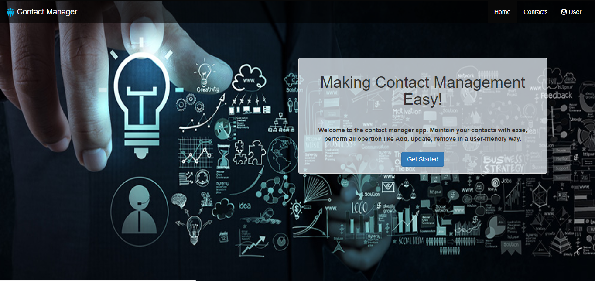

# Contact Manager Website

This is a basic single page application for digitally managing contacts of clients and customers of an organization. This application has been developed in Angular 4 using Bootstrap and PrimeNG Components supported by .NET CORE 2.0 Web APIs using Entity Framework Core and MySQL Database. 

## Running Engage locally

Steps to run the application locally are as below:

1. Clone the repository.

```
	git clone -b sun --single-branch https://github.com/ayushmunjal/Demo-Projects.git
```

2. Set-up Database
Run SQL script Contact Manager/cmdb.sql in MySQL Workbench. 
Check Person table in cmdb database 

3. Run Web APIs
Navigate to CMWebApi folder,
```
	cd Contact Manager/CmApi/CMWebApi/
```
Change the connection string in `appsettings.Development.json` as per you Database and execute the following commands to Restore and host the application
```
	dotnet restore
	dotnet run
```
You can check API here: `http://localhost:5000/api/values/`.

4. Run Website. Please use a new window of command prompt.
```
	cd Contact Manager/CM App/
	npm install
	npm start
```

You can then access CONTACT MANAGER here: `http://localhost:4200/`. 



## Working with CONTACT MANAGER

### prerequisites

The following items should be installed in your system:
* Node.js 
* git command line tool 
* dotnet command line tool (.Net Core 2.x)
* MySQL Database with Connecter/Net

